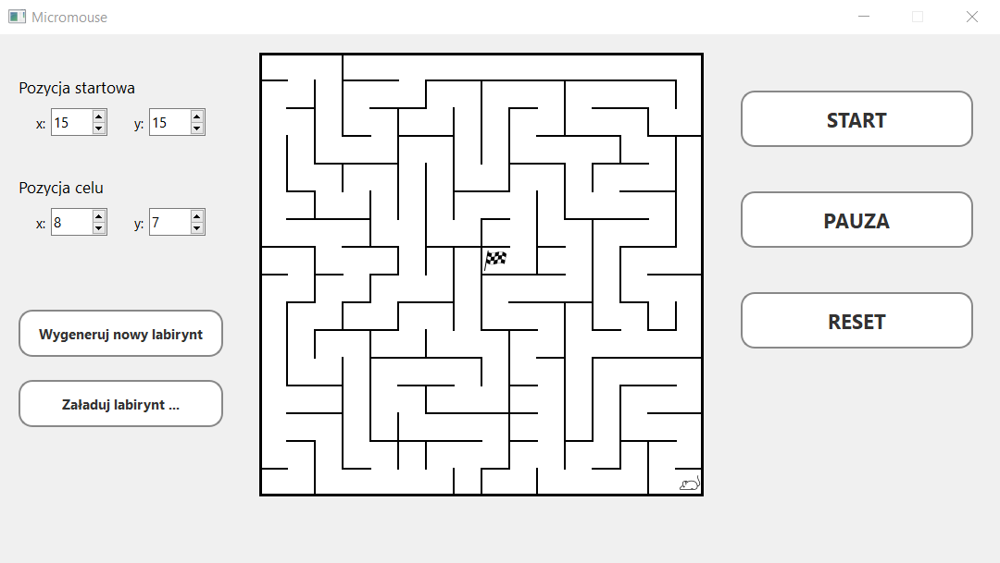

# micromouse

This project contains the source code for the micromouse competition simulator. It was made for the completion of a subject during studies.

To learn more about micromouse competition, see the link below:
<https://en.wikipedia.org/wiki/Micromouse>

## Documentation

The full documentation can be easly obtained from the doxygen file in the main directory of this repository.

## User Interface

The GUI for this project was created using Qt Creator and an example of what it looks like is shown below.

